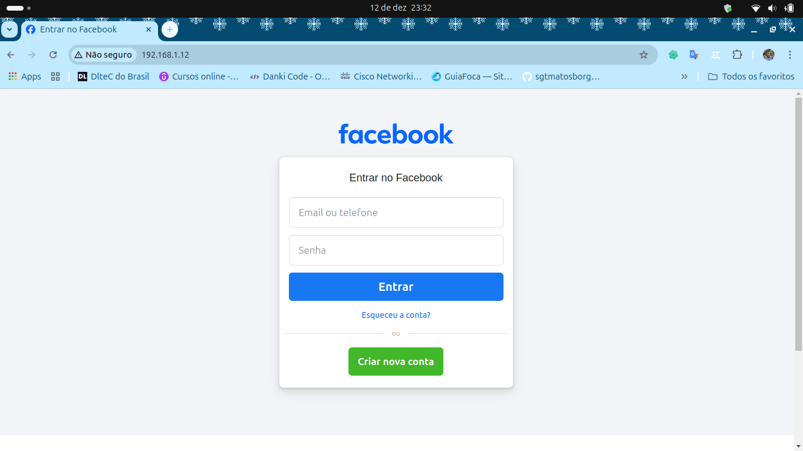
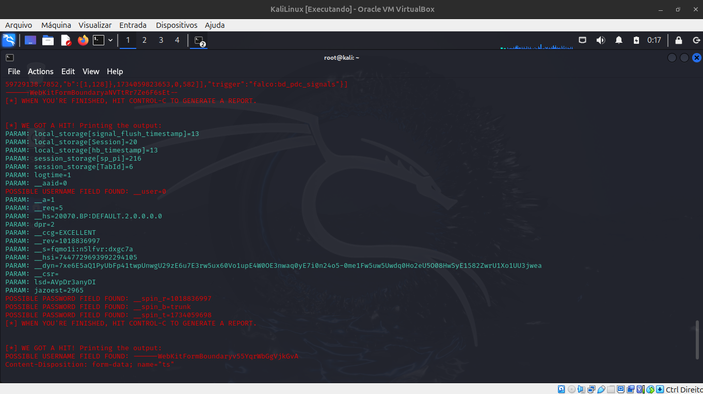

# Criacao-de-um-Phishing-com-o-Kali-Linux
# Phishing para captura de senhas do Facebook

### Ferramentas🐉

- Kali Linux
- setoolkit

### Configurando o Phishing no Kali Linux💻

- Acesso root: ``` sudo su ```
- Iniciando o setoolkit: ``` setoolkit ```
- Tipo de ataque: ``` Social-Engineering Attacks ```
- Vetor de ataque: ``` Web Site Attack Vectors ```
- Método de ataque: ```Credential Harvester Attack Method ```
- Método de ataque: ``` Site Cloner ```
- Obtendo o endereço da máquina: ``` ifconfig ```
- URL para clone: http://www.facebook.com

### Resutados


### imagem captura final de senha 💣

